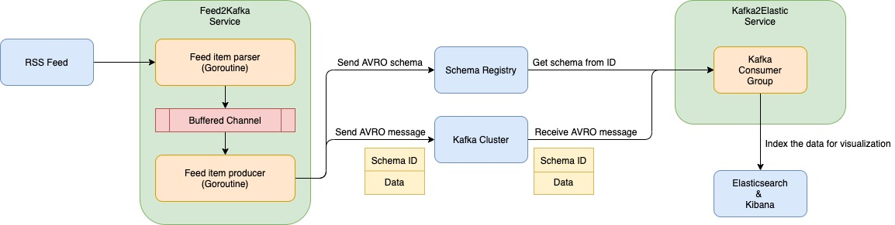
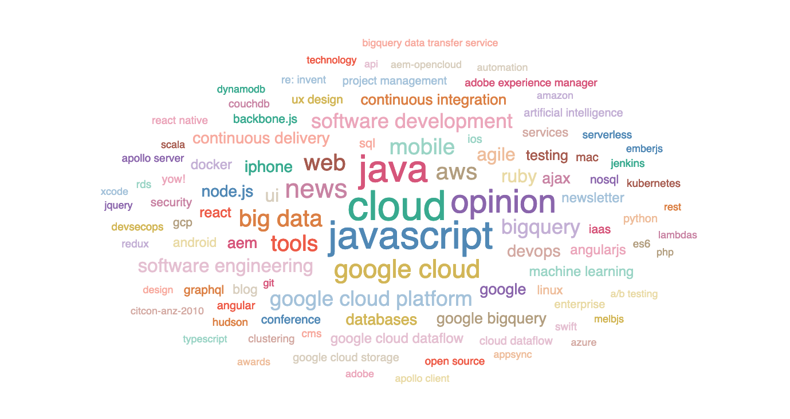
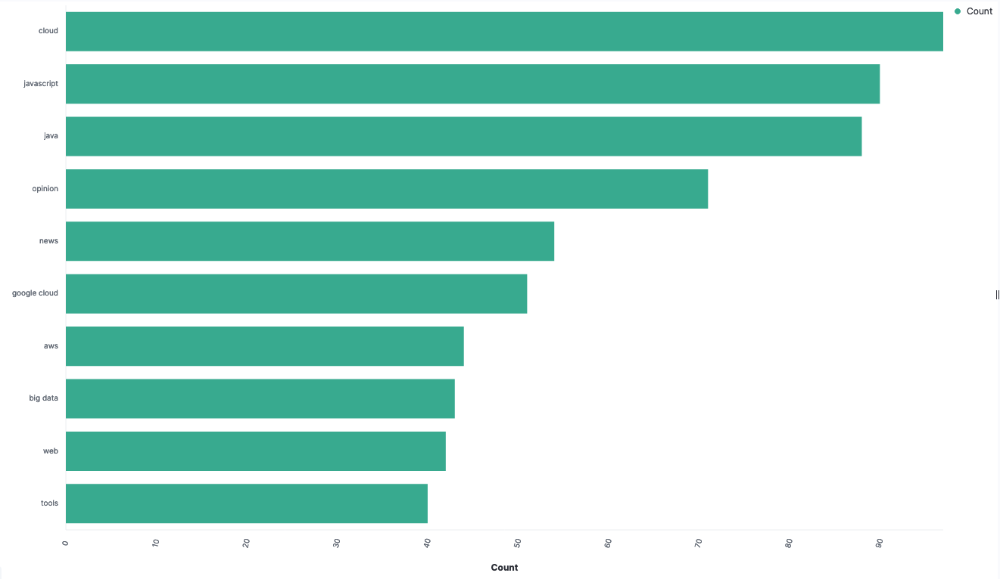

# RSS Feed Visualization

This project is built to fetch RSS feed items from an external source and send them to Elasticsearch and Kibana for indexing and data visualization.

Following the event-driven architecture, this project contains two microservices. One is to pull down RSS feed items, transform and send them to a Kafka cluster, and the other microservice is to receive the feed items from the Kafka cluster and send to Elasticsearch cluster for indexing. The indexed data can be visualized via Kibana.

The project architecture is shown as below.

# Get Started in Local Environment
1. Adjust the configuration via [config.yml](./shared/config/config.yml)
2. Run `cd docker-compose && docker-compose up --build`

# Data Visualization
After all the feed items are indexed in Elasticsearch, we can use Kibana to create visualizations.

Below are a couple of examples.

Example 1: Blog category word cloud

Example 2: Top 10 blog categories

